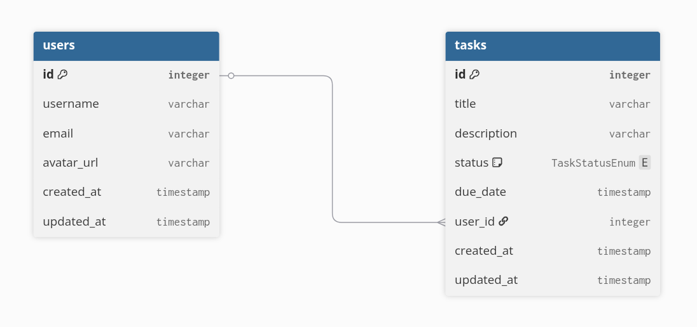

## Nest.js Migration Setup

Practice setting up Nest.js project /w TypeORM migrations

## Description

Main purpose of this repository is for feedback on the way of migration implementation /w Nest.js and TypeORM

Database Schema:



## Project setup

```bash
$ npm install
```

## Compile and run the project

```bash
# development
$ npm run start

# watch mode
$ npm run start:dev

# production mode
$ npm run start:prod
```

## Run tests

```bash
# unit tests
$ npm run test

# e2e tests
$ npm run test:e2e

# test coverage
$ npm run test:cov
```
